# Playlist do Momento

## Sobre o Projeto
**Projeto:** Playlist do Momento

**Problema que resolve:** Dificuldade das pessoas em escolher rapidamente uma playlist que combine com seu humor e o momento atual.

## Integrantes
| Nome | GitHub |
|------|--------|
| Anita Barbosa | @anitaobpuc |
| Ivan Henrique | @Iwanhrq |
| Miguel Moura | @miguelsrmoura12 |

## Arquitetura

```mermaid
graph LR
    subgraph Entrada [Entrada]
        A[n8n Form Trigger]
        A -- "Nome, E-mail, Idade, Cidade, Estado e Humor" --> B((Webhook n8n))
    end

    subgraph Processamento [Processamento]
        B --> C[API Geocoding Open-Meteo]

        C -- "Latitude e Longitude" --> D[API Forecast Open-Meteo]

        D -- "Temperatura" --> E[Gemini IA]

        B -- "Nome, Idade, Cidade e Humor" --> E

        E -- "Gêneros Musicais + Termos de Busca" --> F[Spotify API]

        F -- "Playlist Recomendada" --> G[Montar Resposta Personalizada]
    end

    subgraph Saida [Saida]
        G -- "Playlist + Mensagem Personalizada" --> H[E-mail]
        H --> I{Usuário Final}
    end


    style A fill:#FF6D00,stroke:#333,color:#fff
    style C fill:#4FC3F7,stroke:#333,color:#fff
    style D fill:#29B6F6,stroke:#333,color:#fff
    style E fill:#4285F4,stroke:#333,color:#fff
    style F fill:#1DB954,stroke:#333,color:#fff
    style H fill:#EA4335,stroke:#333,color:#fff
```

## Como funciona

O sistema recebe informações do usuário através de um formulário criado no n8n. Nesse formulário, o usuário informa seu nome, e-mail, idade, cidade, estado e humor atual. Após o envio, o n8n inicia automaticamente o fluxo de automação.

Durante o processamento, o sistema utiliza a API Geocoding da Open-Meteo para localizar as coordenadas da cidade informada pelo usuário. Em seguida, a API Forecast da Open-Meteo consulta dados climáticos e a temperatura atual da região. Todas essas informações são enviadas para a IA Gemini, que analisa o contexto do usuário, considerando humor, idade e clima da cidade, para gerar uma sugestão de estilo musical e termos de busca.

Por fim, o sistema utiliza a API do Spotify para buscar playlists relacionadas à recomendação gerada pela IA. O usuário recebe como saída um e-mail personalizado contendo a playlist recomendada de acordo com seu perfil e o clima atual da sua cidade.

